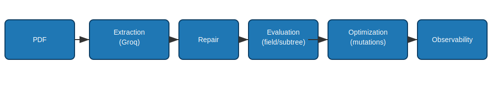
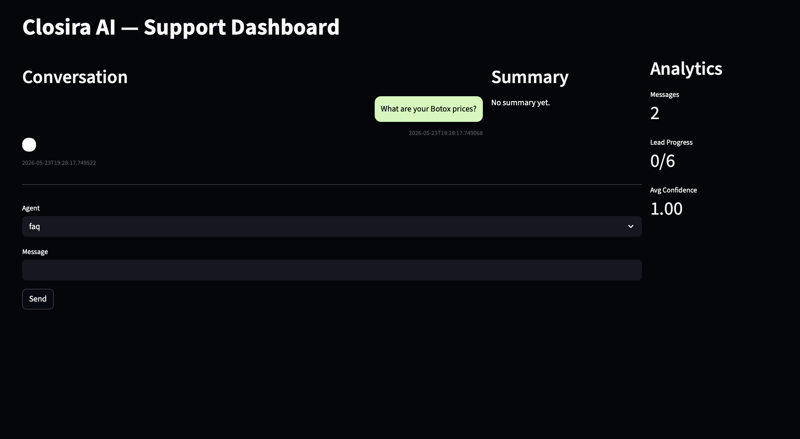
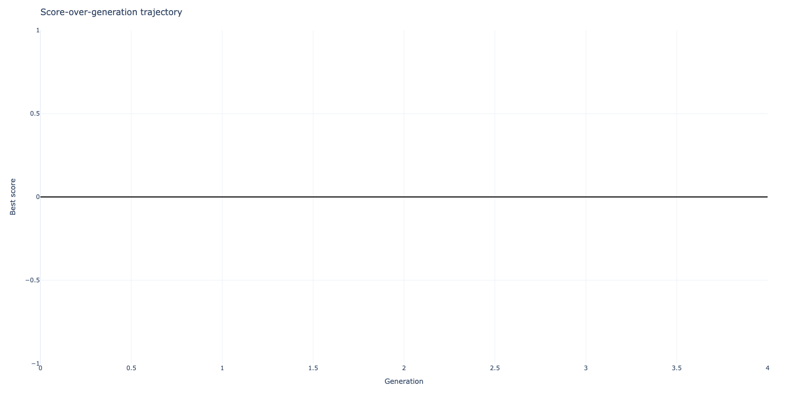
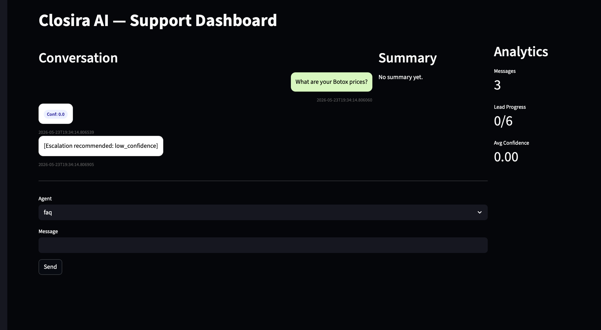
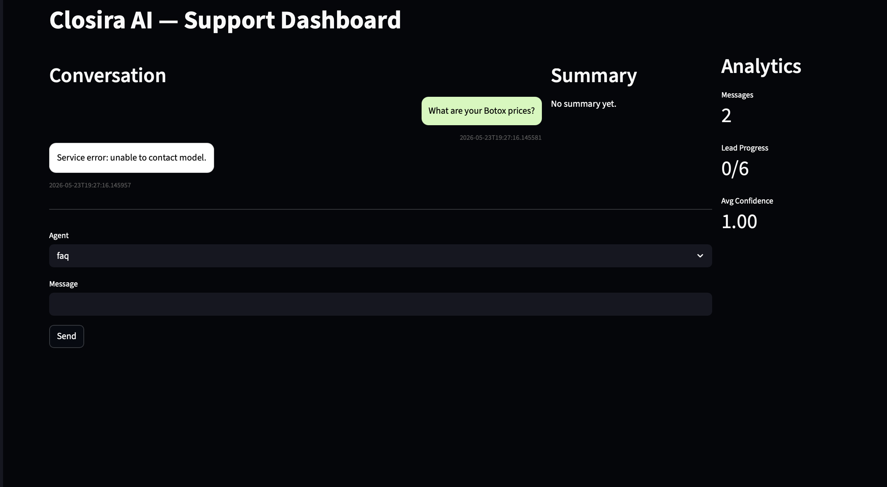

# GegenExtract

GegenExtract is a research-oriented extraction system for converting semi-structured documents (resumes, hiring bench PDFs) into validated JSON artifacts. The project combines schema-aware prompting, repair-aware extraction, hierarchical evaluation, and an autonomous prompt-optimization engine to improve per-field extraction quality with strong observability.

---

## Quick Links

- Dashboard (local): `scripts/launch_dashboard.py` (Streamlit)
- Latest experiment artifacts: `experiments/hiring_run_1/hiring_res_001`
- Field diagnostics: `experiments/hiring_run_1/hiring_res_001/field_diagnostics.json`
- Figures and screenshots: `docs/screenshots/` and `experiments/hiring_run_1/hiring_res_001/figures/`

---

## Project Overview

GegenExtract focuses on robust structured extraction where model formatting and hallucination are first-class failure modes. The system:

- Constructs schema-aware prompts for LLM-based extraction (Groq/OpenAI chat completions).
- Repairs malformed JSON responses (code-fence stripping + constrained repair prompts).
- Evaluates outputs at field and subtree granularity (precision/recall/F1).
- Runs conservative, deterministic prompt-optimization (mutation-based) guided by the evaluator.
- Persists experiments, raw LLM calls, prompt lineage, and artifacts for auditability.

## Architecture Flow



Pipeline: PDF → Extraction (Groq) → Repair → Evaluation → Optimization → Observability

---

## Key Features

- Autonomous prompt optimization (mutation-driven, evaluator-guided)
- Repair-aware extraction (recover malformed JSON)
- Hierarchical evaluation (field/subtree/array-aware)
- Resumable experiments with SQLite persistence and raw LLM call logging
- Streamlit dashboard for experiment exploration and artifact review

---

## Optimization Workflow

1. Seed prompt + constraints generate initial candidates per sample.
2. Evaluator scores candidates per field (precision/recall/F1).
3. Mutations produce prompt variants; candidates are re-evaluated.
4. Selection + duplicate suppression keep the best prompt lineage; stagnation triggers rollback.

---

## Experiment Results (example)

- Run: `experiments/hiring_run_1/hiring_res_001`
- Generations: 5
- Per-generation mean scores (approx): [0.228, 0.225, 0.241, 0.25, 0.241]
- Best observed candidate score: 1.0

See `REPORT.md` and `experiments/hiring_run_1/hiring_res_001/` for full artifacts and analysis.

---

## Screenshots & Figures

Dashboard preview:



Score trajectory:



Prompt diff (seed → best):



Field metrics (F1 per field):



---

## Setup & Reproducible Runs

1. Create and populate a `.env` file:

```
GROQ_API_KEY="your_groq_api_key"
```

2. (Optional) Install OCR prerequisites for PDF OCR fallback:

macOS (Homebrew):

```bash
brew install poppler
pip install pdf2image pytesseract
```

3. Install Python dependencies (recommended in a venv):

```bash
python -m venv .venv
source .venv/bin/activate
pip install -r requirements.txt
pip install plotly kaleido streamlit
```

4. Run the experiment runner (example):

```bash
python scripts/run_resume_experiment.py --config configs/experiment.yaml
```

5. Launch the dashboard:

```bash
streamlit run scripts/launch_dashboard.py --server.port 8501
```

---

## Dashboard Preview

Open the dashboard and enter the experiment ID `hiring_run_1/hiring_res_001` in the sidebar to view the summary, trajectory, prompt diffs, and field metrics.

---

## Key Engineering Features

- Autonomous prompt optimization with conservative search.
- Failure-aware mutation policies and duplicate suppression.
- Hierarchical evaluator for subtree and repeated-array alignment.
- Repair loop for malformed JSON and formatting stabilization.
- Resumable experiments with SQLite persistence and LLM call logging for audits.

---

## Demo Walkthrough Outline

1. Dashboard tour: open experiment, inspect summary and trajectory.
2. Show prompt diff (seed → best) and explain mutation lineage.
3. Demonstrate repair-loop example: malformed → repaired JSON.
4. Share per-field metrics and highlight improvements.

---

## Future Improvements

- Multimodal extraction: enable richer image and layout-aware extraction models for complex documents.
- Stronger semantic evaluators: integrate embedding-based or supervised matchers for improved alignment and scoring.
- Larger-scale, distributed optimization: scale the optimizer across machines/external workers for broader search while preserving determinism via seeded shards.

---

## Repository Organization (top-level)

- `src/` — core library code
- `scripts/` — runners, dashboard launcher, utilities
- `configs/` — experiment configuration files
- `experiments/` — persisted experiment runs and artifacts
- `docs/screenshots/` — presentation-ready images

---

If you'd like, I can also produce a short `slides/` folder with 6–8 PNG slides extracted from the visuals (ready for presenter recording). Otherwise this packaging step is complete and the project is ready for submission and demo recording.
# GegenExtract

GegenExtract is an autonomous prompt optimization framework for structured extraction from PDFs using LLMs.

This repository contains a production-grade, configurable, and research-friendly Python scaffold focused on:

- modular architecture for document processing, extraction, prompt management, optimization, scoring, experiments, and persistence
- config-driven pipelines using YAML and Pydantic
- reproducible experiments with persistent logging and caching
- Streamlit observability dashboard

Getting started

1. Create a virtualenv and install requirements:

```bash
python -m venv .venv
source .venv/bin/activate
pip install -r requirements.txt
```

2. Copy `.env.example` to `.env` and fill secrets.

3. Run Streamlit dashboard:

```bash
streamlit run src/gegenextract/observability/dashboard.py
```

Project layout

- src/gegenextract: core package
- configs: example YAML configs
- tests: pytest test suite

This scaffold focuses on interfaces, config, and reproducibility. Implementation logic comes next.

Phase 1 — Ingestion (implemented)

- PDF ingestion and preprocessing pipeline using PyMuPDF with OCR fallback (pdf2image + pytesseract).
- Deterministic dataset loader for ExtractBench-style datasets.
- File-based cache for processed documents.
- Extensive tests covering edge cases (empty/corrupt/scanned PDFs), cache behavior, and logging.

Running tests

Install dependencies and run tests (uses the `src` package directory):

```bash
python -m venv .venv
source .venv/bin/activate
pip install -r requirements.txt
PYTHONPATH=src python -m pytest -q
```

External tools required for OCR and scanned-PDF processing:

- `tesseract` (for `pytesseract`) — install via your package manager
- `poppler` (provides `pdfinfo`/`pdftoppm` used by `pdf2image`) — install via your package manager

In CI environments, tests avoid invoking external binaries by monkeypatching OCR routines; production runs require the above tools in PATH.

